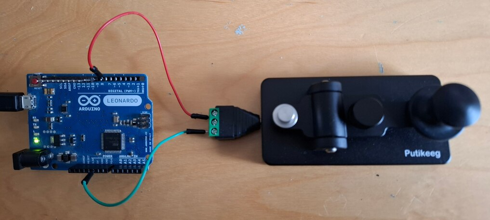

# Response key for human psychology experiments


Many human experimental psychology experiments record reaction-times of manual responses. Although the keyboard or the mouse can be used, they can potentially introduce non negligeable measurement errors ([refs](#refs))
 
The picture below shows a simple response key device based onan [Arduino Leornardo](https://docs.arduino.cc/hardware/leonardo/) microcontroller and a [Morse key](https://putikeeg.com/products/straight-key-morse).  




Pressing the response key close the circuit betwen ground (`GND`) and `pin 7` (through cables connected to a [male jack to terminal block adapter](https://www.amazon.fr/Poppstar-connecteurs-Audio-connecteur-Broches/dp/B07XDMB4LR/).

The Leonardo, attached on a USB port of the computer, is seen as a keyboard. Each time the Morse key is depressed, a character 'f' is sent.

Here is the code:

```C
// code to detect when pin 7 of Arduino Leonardo is connected to GND
//
// Time-stamp: <2024-10-09 christophe@pallier.org>

// #include <Keyboard.h>

#if ARDUINO > 10605
#include <Keyboard.h>
#endif


const int ledPin = 13;
const int button = 7;  // pin 7 is an interrupt on the Leonardo (not the UNO!)
volatile bool toggleValue = 0;
volatile bool intFlag = 1;

bool sent = 0;
char KEY = 'F';

// debouncing
volatile unsigned long lastIntMillis = 0;
volatile unsigned long debounceMillis = 10;

void setup() {
  pinMode(ledPin, OUTPUT);  
  digitalWrite(ledPin, LOW); //start with LED off to save power
  pinMode(button, INPUT_PULLUP);  // this is the pin connected to the button switch
  attachInterrupt(digitalPinToInterrupt(button), isr, FALLING); //isr is the Interrupt Service Routine that will be called when the button is pressed
}

void loop() {
  if (toggleValue) { 
    digitalWrite(ledPin, HIGH);
      if (!sent) {
        Keyboard.write(KEY); 
        sent =1;
      }
    } 
  else { 
    digitalWrite(ledPin, LOW); 
    sent = 0;
  } 
}

void isr(){ // interrupt service routine
  if(millis() - lastIntMillis > debounceMillis){
    toggleValue = !toggleValue;
    intFlag = 0;
    lastIntMillis = millis(); //record time of interrupt
  }
}
```

You can compile and upload this sketch to the Leonardo using the [arduino software](https://www.arduino.cc/en/software) (Do not forget to select `Tools -> Board -> Leonardo` and the serial port address corresponding the the Leonardo (listed in devices))


<a name="refs">References</a>

* Plant, Richard R., Nick Hammond, and Tom Whitehouse. 2003. “How Choice of Mouse May Affect Response Timing in Psychological Studies.” Behav Res Methods Instrum Comput 35 (2): 276–84.
* Shimizu, Hidemi. 2002. “Measuring Keyboard Response Delays by Comparing Keyboard and Joystick Inputs.” _Behavior Research Methods, Instruments, & Computers_ 34 (2): 250–56. https://doi.org/10.3758/BF03195452.


