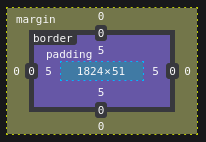
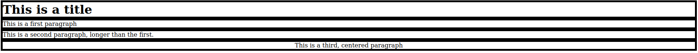

# Using HTML for online stimuli

## Introduction

### Summary of previous session

- Learn how to easily adapt how a trial goes (adding a blank after a trial...)
- Get familiar with reading the (jspsych) documentation
- Learn to use timeline variables

- **Use a plugin in jspsych which allow you to display html formatted pages**
- Give feedback

### Why learn HTML

When running an experiment, you generally want to display stimuli. One way to do it is to load successive images, which you can do using some [plugins from jsPsych](https://www.jspsych.org/latest/plugins/image-keyboard-response/). However, this method has many drawbacks.
- It cannot create very responsive stimuli (e.g. follow your mouse)
- You have to generate all possible images beforehand
- Your participant has to load every single image, which may be very limiting if they don't have a stable connection (e.g., schools!)

###  Today's objective

- Tags in HTML
- Format text with HTML & CSS
- Understand the structure of a HTML page
- Draw on canvas with JavaScript
- Integration in jsPsych
- (if time) feedback

## HTML: the basics

We will focus today on text elements (e.g., for instructions), divisors and canvas. As all HTML elements, they are defined between *tags*, of the form `<(tag-name)>(content)</(tag-name)>`. There are opening and closing tags that surround content: you may just think of them as brackets!

```html
<!DOCTYPE html>
<html>
  <head>
    <title>HTML basic elements</title>
  </head>
  <body>
    <!-- HTML description goes here! -->
    This is just plain text
    <p>This is a paragraph!</div>
    <div>This is a divisor!</div>
    <!-- Note: this will not actually show up: more on this later -->
    <canvas>This is a canvas!</canvas>
  </body>
</html>
```

### Text

#### Paragraphs & Headers

Just like a LibreOffice, Word or Google document, HTML allows you to define several levels of text. The base unit is the paragraph (`<p>`). Anything within a paragraph will simply be rendered as a single chunk of text (there are ways to add line breaks, though). *In other word, HTML ignores line breaks!* Successive paragraphs will be displayed on different line... like successive paragraphs in a book!

```html
<p>This is the first line of a paragraph.

This is the second line of a paragraph, and it is on the same line as the first.</p>
<p>This is another paragraph.</p>
```

You can also introduce titles, with several levels of depth: the highest is defined with `<h1>`, and then `<h2>`, `<h3>`, `<h4>`...

**Small exercise (5 mn):**
- Rewrite this lecture page from the title to this section, using html paragraphs and titles. You can ignore code blocks. SOLUTION TO COME

#### Special fonts

Beyond plain text, you can also specify some text formats, such as bold and italic text (see [here](https://www.w3schools.com/html/html_formatting.asp) for a longer list). Try the following codes:

```html
<p> This text should be <b>bold</b></p>
<p> This text should be <i>italic</i></p>
```

```html
<p> This text should be <strong>bold</strong></p>
<p> This text should be <em>italic</em></p>
```

Why do we have two possible tags for each font style? Well, first, some of you may actually see some differences: `<strong>` and `<em>` do not always entail bold and italic text. These tags only serve to emphasize the text, which is handled differently by some browsers.

#### Styling

##### Coloring text
Sometimes, we may want to do other things than simply bolden or italicize the text, and HTML does not necessarily provide built-in tags for that. This is were *styles* come in.

In HTML, style is an attribute of an element. It is defined in the opening tag of said element: `<(element-name) style="(style)">`. You can define a style by specifying as many properties as you want, with the syntax `"property: value;"`, separating two parameters by a semicolon `;`. This syntax is that of yet another language in our toolbox: CSS.

```html
<p>This text is <strong style="color: blue">blue and bold</strong>.</p>
```

Here, the text is bold because we use `<strong>`, which your browser handles by a bolded font. If you want some basic text instead, you can use `<span>` instead!

**Small exercise (in class):**
You can actually have bold text within a span. There are two ways to do it. What could they be? Hint for one of them: all the HTML elements we saw before appear like this because your browser has a default style for them. You will find more details here: https://www.w3schools.com/cssref/css_default_values.php. Try to implement your solutions!

There are more values you can use: `font-family`, `font-size`... We will focus on some specific properties: `text-align`, and border properties

##### Centering text

You can specify how the text is aligned with `text-align`.

```html
<p style="text-align: center">This text is centered!<p>
```

Can you right-align it now? By the way JsPsych always displays the text centered, unlike our HTML texts from before. How come? Using the inspector, you can look at the CSS properties of any element: you will see that for all paragraphs, jsPsych specifies that it must be centered! This is done using a CSS file: we wont go into the details of it, but know that this is possible (and frequent!).

##### Outlining the border of the text

You should now be a bit more familiar with how to bracket text within tags, and how to style them somehow. But how does this work under the hood? We can use the inspector to get an idea, but you can also make elements more visible on your page. As you can guess, it will require styling, applied to the border of the element.


Try the following code, and look at the result.

```html
<h1 style="background-color:black; color: white">
  This is a title
</h1>
<p style="background-color:black; color: white">
  This is a first paragraph
</p>
<p style="background-color:black; color: white">
  This is a second paragraph, longer than the first.
</p>
<p style="background-color:black; color: white; text-align: center">
  This is a third, centered paragraph
</p>
```

As you can see, html elements, by default, stack on top of each other and their *width* almost span the whole page. Their *height* is defined by that of their content, but they leave some space (called *margin*) around them. In the following section, we will see how to change this organisation.

#### Short summary

So far, you should have learned how to bracket and nest elements within tags. You also have understood the basic concepts of styling, and see how you can see the shape of your divisors.

### Divisors

Divisors are HTML's the most basic element: think of it as a box that surround content: look at the divisors shape in the below example.

```html
<div style="background-color: grey">
  <p style="background-color:black; color: white; text-align: center;">
    This is a third, centered paragraph
  </p>
</div>
```

As you can see, this defines a grey box that contains all the previous text without any *margin*. What if we play with this?

#### Margin and padding

In HTML, some properties require units. Try to define the `margin` property of our div to 5 pixels (`5px`). What happens if you drop the `px` unit?  

And now, try to see the difference if you set `padding` to 5 pixels instead.


 You should something off: there is some added gray on top and bottom on the paragraph, which is definitely greater than 5 pixels. Why ?

If you use your inspector, you may notice that the content of the divisor is indeed surrounded by a 5-pixel wide gray band... and contains the big grey chunk within it. This is because our `<p>` element has a margin as well!

In other words: margin is the space around the border of an element; padding is the space around its content.


Illustration of margin (here 0px) and padding (here 5px) (note that you can also play with the border, but we don't discuss it here).

**Specifying different margins/paddings in different directions.** You can specify different paddings by specifying four values split by values like in the code before. The order is fixed: top, left, bottom and right.

```html
<div style="background-color: grey; padding: 0px 5px 10px 15px">
  <p style="background-color:black; color: white; text-align: center; margin: 0">
    This is a third, centered paragraph
  </p>
</div>
```

**Exercise (15 minutes):**
Starting back from the code below:
- write the **paragraphs and title in black** on a **white background**
- put this in a **div with a black background**, so that there is **5 pixels** between paragraphs the border of the div (both vertically and horizontally!).
- make it so you have 10 pixels between paragraphs.


This is what you should get at the end.

Starting code:
```html
<h1 style="background-color:black; color: white">
  This is a title
</h1>
<p style="background-color:black; color: white">
  This is a first paragraph
</p>
<p style="background-color:black; color: white">
  This is a second paragraph, longer than the first.
</p>
<p style="background-color:black; color: white; text-align: center">
  This is a third, centered paragraph
</p>
```

The solution is [here](../javascript_experiments/html-elements.html).

#### Defining shape

When it comes to the shape of an element there are three properties that will interest us: `height`, `width`, and `border-radius`. All requires units.

Height and width should be pretty explanatory: we will simply mention that you can define the height and width of an element (e.g. a paragraph) with absolute units (e.g., pixels `px`), or relative units: (e.g., percents `%`, which depend on the size of the parent element)

Border radius defines how round the corners of an element are. We will simply remember the `50%` value to create circles.

```html
<div style="width: 600px; height: 200px; background-color: red; margin: 10px"> This is a red rectangle of 600px by 300px</div>
<div style="width: 80%; height: 20%; background-color: orange; margin: 10px"> This is an orange rectangle of 80% of the document body by 30%</div>
<div style="width: 300px; height: 300px; background-color: orange; margin: 10px">Look! A circle!</div>
```

#### Positioning

Three ways: relative, absolute, flex.

### Canvas

You draw on them using javascript!
