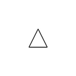
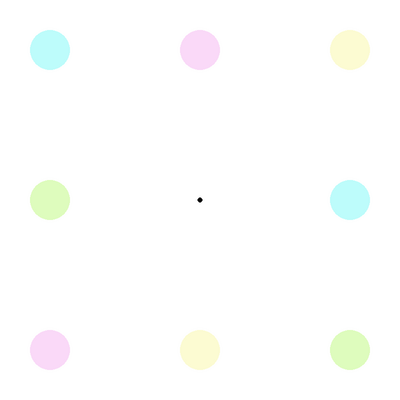
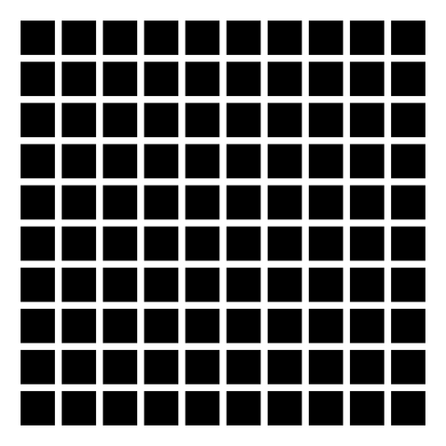

# Download the web site 

    git clone https://github.com/chrplr/programming-psychology-experiments.git

    cd programming-psychology-experiments/stimuli/visual-illusions

    ls *.py

    python square.py

---

# Exercises : basic shapes

|                        |                       |                        |                           |
|------------------------|-----------------------|------------------------|---------------------------|
|  |  |  |  |
| `square.py`            | `circle.py`           | `two_circles.py`       | `triangle.py`             |

Concepts:

 - basic graphics with pygame
 - find documentation (google search, ipython)
 - file comparison

---
## Kanizsa illusory contours

---
## Troxler illusion

concept: rgb colors

---
##  Herman Grid

concepts: 

- nested loops
- reading arguments on the command line 

---
##  Ebbinghaus illusion

concept: use angles

---
## Ebbinghaus dynamic

Run `python ebbinghaus.py` and try to write a script doing the same thing.

