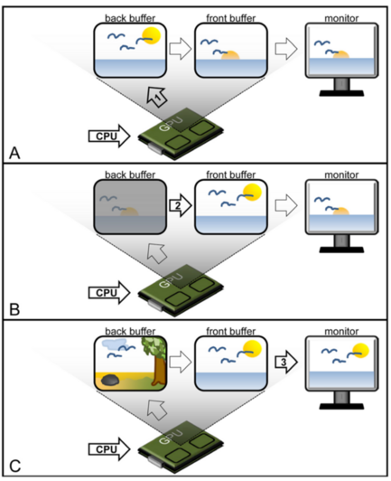
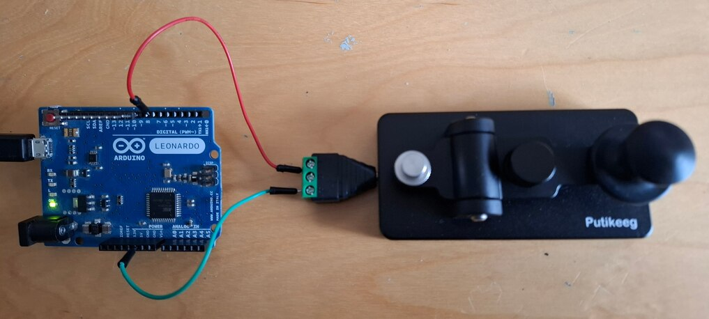

# Illusory line motion

Program the stimulus shown at <https://www.youtube.com/watch?v=hA2Ag1LGJ80>

See Jancke, Dirk, Frédéric Chavane, Shmuel Naaman, and Amiram Grinvald. 2004. **“Imaging Cortical Correlates of Illusion in Early Visual Cortex.”** _Nature_ 428 (6981): 423–26. <https://doi.org/10.1038/nature02396.>

---
# Double buffering 

---
# Double buffering in pygame

We pass the option `pygame.DOUBLEBUF` to `pygame.display.set_mode()`

Programming an animation will follow the following temporal logic::

    #draw picture1 in the backbuffer
    #flip the backbuffer to front buffer, which will be displayed to screen

    #draw picture2 in the backbuffer 
    #wait for some time
    #flip the backbuffer to front buffer

    #draw picture3 in the backbuffer
    #wait for some time
    #flip the backbuffer to front buffer

---
# Vertical synchro

The display of the front buffer must not happen during a swap as this will cause **tearing**. The **V-sync** option should be selected in your video driver parameters.

Run <https://github.com/chrplr/programming-psychology-experiments/blob/main/experiments/timing_checks/xpy_tearing_test.py>

If the line is broken, the video card swap and the screen refresh are not synchronized.

If you have vertical enable, `pygame.display.flip()` will _block_ until the next refresh to return. 

Run <https://github.com/chrplr/programming-psychology-experiments/blob/main/experiments/timing_checks/rotating_disk/rotating_disk_pygame.py> to see the time elapsed between two successive frames.

---
# G-Sync

See Poth, Christian H., Rebecca M. Foerster, Christian Behler, Ulrich Schwanecke, Werner X. Schneider, and Mario Botsch. 2018. **“Ultrahigh Temporal Resolution of Visual Presentation Using Gaming Monitors and G-Sync.”** _Behavior Research Methods_ 50 (1): 26–38. <https://doi.org/10.3758/s13428-017-1003-6.>
 

---
# Reaction times

Goto to chapter **Reaction times** of <https://programming-psychology-experiments.rtfd.io/>

1. run `simple-detection-visual-pygame.py` and check your results saved in the file `reaction_times.csv` 

2. look at the code. Can you understand it?

3. Try to modify it to display the target cross at one of two random locations, left or the right of the center of the screen.

---
# same using expyriment

Got to `xpy_simple_reaction_times`

1. run `python simple-detection-visual-pygame.py` 

2. Look at the code.

Do the exercices in the document  (until parity decision)

---
# A remark on response devices

RTs measures from keyboard or the mouse are not very precise.

<https://github.com/chrplr/arduino_leonardo_reponse_key>

